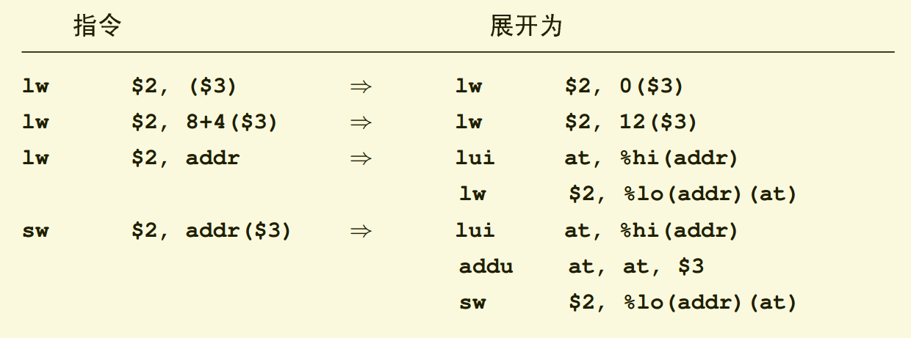

## 一些概念
### 立即数
在汇编语言或者机器语言里，嵌入在指令中的常数被称为立即数。MIPS的很多算数和逻辑指令都有另外一种用16位的立即数取代t寄存器的形式。立即数首先通过符号扩展或者零扩展扩展为32位。
#### 带立即数的运算指令
例子：ori 目标寄存器，$0,立即数
### 简写
MIPS执行计算的机器指令是三寄存器操作，就是说为两个收入和一个输出的算数或逻辑函数，例如
d=s+t
写成addu d,s,t。
我们也提到过这里的三个寄存器可以重复。要生成一条CISC风格的双操作指令，用一个和源操作数相同的目的寄存器就行了。如果你省略了s汇编器会自动帮你做：把addu d,s当做addu d,d,s同等看待。

## MIPS寻址方式
* 如果要访问内存，只能够使用load/store指令 
* 其他的只能是寄存器操作
### MIPS寻址模式
前面提到过，硬件只支持一种寻址模式：寄存器基地址+立即数偏移量（base_reg+offset），偏移量offset必须在-32767到+32767之间。但是汇编器能够合成代码来访问各种别的方式指定的地址处的数据。这些方式包括：
* Direct(直接)：由你提供的数据标号或外部变量名。
* Direct+index(直接加索引)：一个偏移量，加上由寄存器指出的标号地址。
* Constant（常数）：一个解释为32位绝对地址的常数。
* Register indirect（寄存器间接）：是寄存器加偏移量，偏移量为零的特殊形式。
上面的这些寻址方式，结合汇编器在编译时的一些简单的常数运算，加上宏处理器的使用，你就能够完成大多数要做的事情。例子：

上例中的addr符号可以是以下任何一种：
* 可重定位的符号——标号或者变量的名字（本模块内部或者别处）
* 可重定位的符号±一个常数表达式（汇编器或者链接器可以在生成目标代码时处理这些）
* 32位的常数表达式（例如设备寄存器的绝对地址）

#### 相对于GP的寻址
MIPS整个指令集都被塞在32位操作空间里的做法导致了一个直接后果就是，访问一个编译进来的存储器地址往往要花费至少两条指令，例如

lw $,addr	=> 	lui	at,%hi(addr)

				lw	$2,%lo(addr)(at)

在大量使用全局或静态数据的程序中，这往往导致最后编译出的代码臃肿而低效。

早期的MIPS编译器针对这个问题引入了一种修正技术，大多数的MIPS编译工具都一直沿用了这一做法，通常被称为“全局指针gp相对寻址”。这个技术要求编译器、汇编器、链接器以及启动代码互相协同配合，把程序中的“小”的变量和常数汇集到一块独立的内存区域；然后设置寄存器$28（也称为全局指针（global pointer）或gp寄存器）指向该区域的中央。（链接器生成一个特殊符号-gp），其地址为该区间的中央。


### 访问内存只能通过简单的寄存器加载和储存
对内存变量进行算术运算会打乱流水线，所以不这么做，每次内存访问都要一条显式的加载或储存指令。（需要对内存数据计算的时候需要先加载到寄存器再操作，也就是分2步执行）

### 只有一种数据寻址方式
几乎所有的加载和储存都通过单个的寄存器基址加上一个16位的常数偏移量（浮点指令可以使用有限的寄存器加寄存器）寻址内存。

### 字节地址指令
一旦数据存入MIPS的寄存器，所有的操作都是在整个寄存器上操作。但是像C这样的语言不适合不能寻址内存到字节粒度的机器。因而MIPS对8-16位变量（分别称为字节和半字）提供了一套完整的装入/存储操作。一旦数据到达寄存器，就当做寄存器全长来处理，所以部分字加载指令有两种形式——符号扩展和零扩展。

### load/store必须对齐
内存操作只能从对其到相应数据类型边界的地址加载和储存数据。字节可以在任意地址传输，但是半字必须在偶数地址对齐，字在四字节边界对其，许多CISC微处理器可以从任意地址加载、存储四字节数据，但是要花费额外的时钟周期。

但是，MIPS指令集体系结构（ISA）确实包含有几个特殊的指令以简化对没有适当对齐的地址存取操作。

### 跳转指令
有限的32位指令长度在想要支持很大程序的体系结构上对分支是个问题。MIPS指令的长度的最小操作码为6位，留出了26位来定义跳转的目标。因为所有指令在内存中都是四字节边界对齐的，低两位地址无需保存，这样可有2^28=256M的地址范围。这个地址不是相对PC的，而是解释成256MB的段内的绝对地址。这对于大于256MB的单个程序极为不便，但到目前还没有碰到太大的问题。

超出段内的分支可以通过使用一个寄存器跳转指令做到，该指令可以跳转到任意32位地址。

条件分支只有16位的偏移域——给出了2^18字节的范围，因为指令都是四字节对齐的————解释成相对PC的带符号的偏移量。如果知道分支目标会在紧跟分支之后的指令的128KB范围内，编译器就只能生成一个简单的条件分支指令。

### 立即寻址与间接寻址
#### 立即寻址
例如：la $to ,var1 表示的是将var1中的内存地址塞入$to中
地址是寄存器的内容（也可以理解为指针）
## MIPS 没有的特性
### 没有字节或者半字数据的运算
所有算数和逻辑操作都在32位的数据上进行。字节或半字的运算需要大量额外的资源和许多额外的操作码，而且很少有用。C语言的语法让大多数的计算用int类型，对于 MIPS而言，int就是32位整数。dan

然而当程序明确做short或者char运算时，MIPS编译器必须插入额外的代码以保证结果回绕和溢出，生成跟16或8位机器上一样的效果。

### 没有对堆栈的特殊支持
传统的MIPS汇编确实定义了一个寄存器作为堆栈指针，但是硬件上SP没有任何特殊之处。有一种推荐的关于子程序调用的栈帧布局，这样可以混合不同语言和编译器的模块；

### 最少的子程序支持
跳转指令有一个跳转并链接的选项，把返回地址存入一个寄存器，默认是$31。所以方便起见习惯上用$31作为返回地址寄存器。

这样做比把返回地址保存到堆栈上要简单，但却带来明显的好处。
* 保持了分支和访存指令的完全分离
* 当调用许多根本不需要在堆栈保存和返回地址的小程序时，这样做有助于提高效率。
### 最少的中断处理
中断只是异常的一种类型（MIPS中异常这个词包括所有需要CPU中断正常的顺序执行并调用软件处理的事件）。一个异常可以来自一个中断、来自对物理上不存在的虚拟内存的试图访问、或者其他很多情况。


## MIPS汇编
汇编语言必须指定四件事：
* 操作
* 第一个操作数寄存器
* 第二个操作数寄存器
* 目标寄存器
当然，机器语言必须以位模式对相同的四件事进行编码。
### MIPS指令特点
#### 单位换算
* 各单位：1字节=8位，半字长=2个字节，1字长=4个字节
* 一个字符空间=1个字节
* 一个整型=一个字长=4个字节

#### 指令特点
* 操作数只能是寄存器，不允许出现地址
* 所有指令统一是32位
* 单个字符用单引号，例如：'b'
* 字符串用双引号，例如："A string"
### 加载和储存（Load and Store）
* 当一个字（4个字节）被装载或存储时，存储器地址必须是四的倍数。这称为对齐限制。四的倍数的地址称为单词对齐。此限制使硬件更简单，更快捷。
指令名|英文原意|功能
-|-|-
lw|load word|加载一个字（4个字节），存储器地址必须是四的倍数。这称为对齐限制。四的倍数的地址称为单词对齐。
sw|Store word|该sw指令将来自寄存器的字存储到存储器中。每条指令指定一个寄存器和一个存储器地址

#### 大端模式和小端模式
* 大端字节顺序：数据 的最高有效字节（“大端”）放在地址最低的字节处。其余数据按顺序放置在内存的后三个字节中。
* 小尾数字节顺序：数据 的最低有效字节（“小尾数”）放在地址最低的字节处。其余数据按顺序放置在内存的后三个字节中。
这些定义中，数据被视为32位无符号整数。“最高有效”字节是两个最大幂的字节：27, ..., 20
#### MIPS和SPIM的顺序
在一个字节内，对于所有处理器，位7是最高有效位。因此，两个字节排序的大结束字节看起来都相同。通常在印刷材料中，该位显示在左侧，如中所示<u>0</u>0010010。
* 除了讨论字节顺序时，“大头”字节称为“高位字节”或“最高有效字节”。

#### 加载或存储指令如何指定与自身大小相同的地址？
答：基址+偏移

引用内存的指令使用基址寄存器和偏移量。基址寄存器是包含32位地址的通用寄存器。偏移量是指令中包含的16位带符号整数。基址寄存器中的地址之和加上（符号扩展）偏移量就形成了存储器地址。

```
#加载字
lw   d,off(b)	#来自内存地址的字
				\#b是一个寄存器，off是一个16位二进制补码
				\#在一个机器周期延迟之后，内存中的数据以$d的形式可用
```
在执行时，会发生两件事:
* 通过添加基寄存器b和偏移量来计算地址
* 从该地址处的内存中获取数据。
因为从内存中复制数据需要时间，所以在寄存器$d中数据需要两个机器周期之后才可用。就汇编语言而言，这意味着lw的指令不能使用$d。

#### 基址如何进入基址寄存器
lui(load upper immediate) 它将其16位立即数操作数复制到指定寄存器的高2个字节。
```
lui  d,const  # $d的两个高字节 <— 两个字节常量 
			 \# $d的两个低字节 <— 0x0000
```
* 填写低位两个字节:零扩展imm到32位，然后与寄存器$s的内容进行按位或运算。结果记入寄存器$d。
```
ori d,s,imm
```

#### 更多的内存访问
##### 加载字节和存储字节： lb， lbu，和 sb
```
lb t，off（b）＃$ t <- 二进制符号扩展
              \#从存储器地址b + off
              \#b是基址寄存器。
              \＃off是16位二进制补码。
```
该lb指令将来自存储器的字节加载到寄存器的低八位。这些是寄存器的0-7位。然后，它将位7复制到寄存器的位8-31（所有7位左侧的位）。

换句话说，该 lb指令在指定地址向寄存器加载了字节的32位符号扩展版本。
```
lbu t，off（b） #$<- 二进制符号扩展
				\#从储存器地址b+off
				\#b是寄存器地址
				\#off是16位二进制补码
```

lbu指令用零来填充寄存器的8-31位。当字节被视为ascii字符或8位无符号整数时，请使用此指令。
* 储存字
```
sb t，off（b）＃off + b <— 低位 
```
寄存器低位字节中的任何内容都将复制到内存中。其余寄存器将被忽略。当然，寄存器不会更改。

有三个指令没有对齐要求： lb， lbu，和 sb。可以使用存储器中程序数据可接受的任何字节。
##### 半字加载和存储半字： lh， lhu，和 sh
MIPS 半字是两个字节。这也是经常使用的数据长度。在ANSI C中，短整数通常是两个字节。因此，MIPS具有加载半字和存储半字的指令。

有两个加载半字指令。一个将存储器中半字的符号位扩展到寄存器的高两个字节。另一个以零扩展。
* 加载半字
```
lh   t,off(b)   # $t <— 符号扩展半字 
                \# 从内存地址b+off开始
                \# b是一个基本寄存器
                \# off是一位16位二进制补码
lhu  t,off(b)   # $t <— 零扩展的半字 
                \#从内存地址b+off开始
                \#b是一个基本寄存器
                \#off是一位16位二进制补码
```
半字 地址必须与 半字对齐。尝试从未对齐的地址加载半字将导致陷阱。
*  储存半字
只需要一个存储半字指令。无论高字节的前两个字节是多少，指定寄存器的低两个字节都将被复制到内存中。当然，将寄存器的数据复制到存储器时，寄存器不会更改。
```
sh    t,off(b)    #Halfword at off+b <— low-order 
                  \# two bytes from $t.
                  \# b is a base register. 
                  \# off is 16-bit two's complement.
```
##### 少于32位的算术运算。
MIPS所有算术都是32位，MIPS没有八位算术指令。假设两个寄存器的低位字节中有两个操作数（如上所述）。这些寄存器的全字加法将低位字节中的结果与8位加法器中相同。但是，8位的高位的进位变为32位结果的第8位。可以使用其他位操作指令来处理它。

因此，既不需要八位算术指令，也不需要半字算术指令。
### 计算指令
#### 二进制算术运算
##### 加法运算
* add
addu指令对两个32位寄存器内容执行二进制加法算法，并将结果放入目标寄存器。
```
addu  d,s,t # d <—— s + t  # 没有溢出陷阱
```
* 带溢出陷阱
* 还有一条指令“add”，当检测到二进制补码溢出时add会导致陷阱，除此之外，它与addu相同。陷阱是在正常机器周期的中断。通常，在计算机系统上，陷阱会导致将控制权发送回操作系统。
```
add   d,s,t			# d <—— s + t   
```
* 带立即数的符号扩展加法 addiu
当ALU执行指令时，立即数被符号扩展为32位。如果加法期间发生二进制补码溢出，则将其忽略。

执行过程中，首先将16位立即数带符号扩展成32位，再参与运算。运算过程中忽略溢出。例子：
```
addiu d，s，const
```
##### 减法运算
MIPS具有两个整数减法指令
* subu
```
subu d，s，t		#没有溢出陷阱,等效于$ d =s +（-t）
```
* sub

##### 乘法运算
MIPS的乘法单元包含两个称为hi和lo的 32位寄存器。这些不是通用寄存器。当两个32位操作数相乘时， hi和lo保留结果的64位。位32至63在hi中， 而位0至31在lo中。以下是执行此操作的说明。操作数包含在通用寄存器中。
```
mult s,t	#hilo <- $s * $t	#（二进制的comp操作数）
multu s,t	#hilo <- $s * $t	#
```
###### 有效位
* 以二进制表示的正数或无符号数的有效位是最高有效位1位（最左边的1位），而其右边是所有位。例如，以下具有32个有效位：
```
0000 0000 0100 0011 0101 0110 1101 1110
```
* 以二进制补码表示的负数的有效位是最高有效0位（最左边的0位），而其右边则是所有位。例如，以下具有23个有效位：
```
1111 1111 1011 1100 1010 1001 0010 0010
```
* 为确保乘积不超过32个有效位，请确保每个操作数中的有效位总数不超过32。
###### mfhi和mflo
有两条指令可以将乘法结果移入通用寄存器
```
mfhi    d        #  d <— hi.  Move From Hi
mflo    d        #  d <— lo.  Move From Lo
```
hi和lo寄存器不能与任何其他算术或逻辑指令一起使用。如果想做什么操作，必须将其移动到通用寄存器。但是，MIPS硬件还有进一步的复杂之处：
* 请勿在mflo 或之后的两个指令中使用乘法或除法指令mfhi。

##### 除法运算
用N位整数除法得到两个结果，即N位商和N位余数。使用32位操作数，通常会有两个32位结果。MIPS将hi和lo寄存器用于结果：
div和divu是整数除法的MIPS指令。“ u”表示操作数和结果为无符号二进制。
```
div s，t＃lo <— s div t
                  \＃hi <— s mod t
                  ＃操作数是二进制补码
divu s，t＃lo <— s div t
                  \＃hi <— s mod t
                  ＃操作数是无符号的
```
与整数法一样，指令mflo和 mfhi 用于获取整数除法的结果。
### 逻辑AaLU指令
#### 指令 ori 
格式：ori 目标寄存器，寄存器A，寄存器B

一些技巧：ori 目标寄存器，$0,立即数

上述操作可以将立即数中的值0扩展后加载到目标寄存器

#### 与指令 andi
与或指令类似，不再详细解释
#### 移位指令
sll：左移；srl：右移

例子：sll $9,$8,2	#左移2位

MIPS具有右移算术指令：
```
sra    d,s,shft   #  $d <— s 右移
                  \#  shft 二进制位移
                  \#  0 ≤ shft ≤ 31
```
有时您需要一分为二。该指令比该div 指令更快，更方便 。
#### ALU操作过程
当执行ALU操作时：
* 将数据从寄存器复制到ALU中。
* ALU进行操作。
* 将结果写入指定的结果寄存器。
当操作数寄存器也是结果寄存器时，没有问题，因为操作数数据已在第一步中传输到ALU，使寄存器保持打开状态以接收结果。
例子：
或运算：or  d,s,t
和运算：and  d,s,t

异或：即：参加运算的两个对象，如果两个相应位为“异”（值不同），则该位结果为1，否则为0。

例子：xor  d,s,t

技巧：通过将NOR指令与$0操作数之一一起使用，可以完成取反操作

例子：nor $1,$0,$1

或非：先按或的操作，然后结果取反

例子：nor  d,s,t
### 分支和循环
### 跳转指令
* 跳转说明：
j 指令（jump）
* 条件分支指令：
beq 指令（branch equal）
bne 指令（branch not equal）
##### 原理——更改程序计数器的值
主存储器的每个字节都有一个地址。每个机器周期执行一条机器指令。在机器周期的顶部，PC（程序计数器）包含要从内存中提取的指令的地址。指令被提取到处理器中并准备执行。当执行跳转指令时（在机器周期的最后一步），它会将一个新地址放入PC。现在，在下一个机器周期顶部的提取将在该新地址处提取指令。处理器不执行在存储器中跳转指令之后的指令，而是“跳转”到存储器中其他地方的指令。
* PC更改生效需要花费额外的机器周期。
* 在PC更改之前，将提取并执行内存中跳转指令之后的指令。
* 该指令执行后，下一条要执行的指令就是跳转到的那条指令。
* 存储器中跳转指令之后的指令被称为在分支延迟槽中。
##### 指令详解
###### 例子
```
j 目标地址 #在一个机器周期之后
			#PC <-目标地址
```
###### 26位地址转换32位
指令中有26位地址的空间。26位目标地址字段转换为32位地址。这是在运行时执行的，因为执行了跳转指令。

指令始终以四个地址的倍数开头（它们是字对齐的）。因此，32位指令地址的低两位总是“ 00”。将26位目标左移两位将得到28位字对齐的地址（低两位变为“ 00”。）

移位后，我们需要填写地址的高四位。这四个位来自PC中的高四位。它们被连接到28位地址的高位端以形成32位地址。

大多数跳转和分支机构都到附近的地址。跳转指令的目标和跳转指令之后的指令很可能在内存中靠近在一起。它们地址的高四位将是相同的。因此，PC的高四位与目标地址所需的相同。

* 跳转指令不能跳转到完整的32位地址空间中的任何任意位置。它必须跳转到以下范围内的地址：
```
wxyz 0000 0000 0000 0000 0000 0000 0000
                   。
                   。
                   。
wxyz 1111 1111 1111 1111 1111 1111 1100
```
在此，wxyz代表PC的高四位。几乎总是跳转指令和跳转地址都在此范围内。
#### 条件分支
```
beq  u,v,addr   # if register $u == register $v
                /#     PC  <— addr (一个机器周期的延迟之后)
                /# else
                /#     no effect.
```
比较两个寄存器中的位模式。如果位模式相同，则将PC更改为分支地址。该指令后有一个分支延迟槽（就像跳转指令一样）。

####  设定指令
##### 小于零时分支，大于零时分支
如果整数严格小于零，则第一条指令分支。如果整数大于或 等于零，则其他分支 。
这两个指令后都有一个分支延迟时隙。这意味着该插槽中的指令将始终执行，并且分支（如果发生）直到该指令完成后才会发生。
```
bltz   s,label        #  如果寄存器s中两个的比较整数< 0，则按照指令进行分支延迟。
bgez   s,label        #  如果寄存器s中两个的比较整数是>= 0，则分支延迟时隙遵循该指令
```
这两个指令后都有一个分支延迟时隙。这意味着该插槽中的指令将始终执行，并且分支（如果发生）直到该指令完成后才会发生。
##### 两个寄存器的数比较
```
slti  d,s,imm	#寄存器$s和imm包含两个要比较的整数
				#-32768<=imm<=32767
				
				#if($s<imm)
				#d=1
				#else
				#d=0

sltiu  d,s,imm  #sltiu是slti的无符号版本
```
在这两种情况下，机器指令的立即数字段均为16位宽。但是，该sltiu指令只能与0 <= imm <= 32767的小整数一起使用
### 循环程序循环的一种常见类型是由整数控制的整数，该整数从初始值开始递增到上限。这样的循环称为计数循环。该整数称为 循环控制变量。循环通过条件分支，跳转和条件设置指令实现。
* 计数器必须初始化。
* 测试必须以正确的计数结束循环。
* 计数器必须增加


## MIPS扩展汇编
### 加载
#### move
没有对应的机器指令，编译器会将其转化成基础汇编语言，然后转换成机器指令
```
move $s1 ,$t3
#内容val被赋值到寄存器$s1中。
```
上面代码实际效果是 ori $s1,$0,$t30

#### 立即加载 li
```
li   d,value #用正整数或负整数“value”加载寄存器$d。值可以是16位或32位整数。
```
转化成基本汇编指令
```
ori d ,$0 ,value
```
li(load immediate)伪指令用于加载带有整数值的寄存器。下面是另一个例子:
```
li  $t2,-156
```
这将二进制补码-156<sub>10</sub>的表示形式放入寄存器$t2。但是，这不能用ori实现，因为该指令的立即字段必须是一个16位无符号整数(执行时从0扩展到32位)。因为li的直接值是负数，所以使用了不同的翻译:
```
li $v2,-156   ==   addiu $v2,$0,-156
```
* 在执行加法之前，addiu符号扩展了它的直接操作数。
* 助记符的u部分意味着溢出不会导致陷阱。addiu指令可用于负整数
扩展的汇编程序根据当前值的符号将li转换成不同的基本指令。

机器指令具有固定大小的字段。立即操作数始终为16位。但是，可以使用两条机器指令以32位整数的上半部分和下半部分加载32位寄存器：
```
li $v1,0x12345678	    ==   	lui $v1,0x1234
						 	 	ori $v1,$v1,0x5678
```
在这里， li 翻译成两个基本说明。第一个载入的上半部分$v1。第二个使用该ori操作加载下半部分。对于需要比立即操作数可以容纳的位数更多的任何整数（正数或负数），可以完成此操作。因此，扩展的汇编语言程序员有一条非常有用的指令：
```
li d，value #用正整数或负整数“value”加载到寄存器$d。值可以是32位以内的任何整数。(伪指令)
```
扩展的汇编程序自动地将这个伪指令转换成最有效的实际指令序列。

#### 加载地址伪指令
并非总是可能事先知道地址，通常，符号地址和系统软件使此操作变得不必要。这通过使用la助记符来实现。该助记符与单个机器指令不对应。这是一条伪指令，汇编程序会将其转换为几条机器指令。
```
la d,exp #使用表达式“exp”描述的地址加载到寄存器$d“。exp”通常是一个符号地址
```
在此伪指令中，exp 是一个计算结果为内存地址的表达式。有几种可能的形式 exp。通常它是一个符号地址。该la 伪指令翻译成不同的机器指令取决于exp。

#### 加载字 lw
所述 lw伪指令拷贝来自存储器的数据的一个字到寄存器：
```
lw d，exp #加载寄存器$d，其值为address exp.exp可以是几种计算地址的表达式类型中的任何一种(伪指令)
```
第二条指令的转换是一条普通的加载指令，在使用加载值之前，它需要延迟一条指令。
#### 存储字 sw
sw d，exp＃将寄存器$ d存储到地址exp的字中。 

#### 无操作
寄存器$0始终包含一个32位的零，因此将其左移零位置并尝试将结果放回去$0无济于事。任何尝试更改的$0指令都不会执行任何操作，但是此指令是不执行操作的首选方式。

一种什么都不做的机器指令（按官方计算机科学术语）称为“无操作”。的无操作指令是令人惊讶的是有用的，尤其是对MIPS。

* 伪指令 nop
实际含义
```
sll $0 ,$0,0
```
### 系统调用 syscall？？？
SPIM包含一个“异常处理程序”，该异常处理程序可以模拟一个小型操作系统，该操作系统可以从键盘进行输入并输出到监视器。

汇编语言程序使用该syscall指令请求操作系统服务。该syscall 指令将控制权转移到操作系统，然后操作系统执行请求的服务。然后，控制（通常）返回程序。

syscall＃要求操作系统执行服务
不同的操作系统以不同的方式使用此指令。对于SPIM异常处理程序，其用法如下：
```
li $ v0，code＃将操作系统服务的“代码”编号加载到$ v0中
.......＃将服务参数放入
.......＃寄存器$ a0，$ a1或$ f12（请参见下文）。
syscall＃调用操作系统。

                  ＃返回值（如果有的话）在$ v0或$ f0中
```
### 逐位逻辑和数学指令
当您使用伪 指令编写程序时，它看起来就像计算机上有一组方便的机器指令一样。实际上，这些方便的指令均通过使用基本指令来实现。扩展汇编程序用一个或多个基本指令替换每个伪指令。然后将基本说明翻译成机器代码。
#### not 伪指令
改变寄存器的每个位。每个1更改为0，每个0更改为1。（有时称为“翻转”每个位或“反射”每个位。）
```
not   d,s #按位加载寄存器d取反后放到寄存器s
```
汇编程序将其转换为一条基本的汇编指令，即一条nor 指令。
```
nor  d,$0,s
```
或者
```
nor  d,s,$0
```
#### 隐式立即数？
某些伪指令会根据操作数的类型转换为不同的基本指令。与立即数操作数一起使用的伪指令转换为与所有寄存器操作数一起使用的伪指令不同的基本指令。

有时，相同的助记符用于基本指令和伪指令。例如，可以将助记符or 用于或带有寄存器操作数，也可以用于或带有立即数操作数：
```
or $s0,$s1,0x00ff      转换为:      ori $s0,$s1,0x00ff
```
#### 算术伪指令
#####加法
对于非扩展汇编程序，有一条   addu d,s,t  指令，其中d，s和t是寄存器，一条   addiu d,s,imm  指令 imm是立即数操作数。

使用扩展汇编程序时，   addu d,s,x  指令会根据转换为不同的基本指令x。 x可以是寄存器，16位立即数或32位立即数。

例子：
```
addu $t0,$s0,40000
```
十进制值40000太大，无法用16位表示（16位的范围是-32768到+32767），因此该指令不能转换为基本 addiu 指令。必须使用两条指令来$s0加到40000<sub>10</sub> 并将结果放入$t0。
##### 减法
还有一个（带有扩展汇编程序的）subu d,s,x 指令.其中最后一个操作数可以是寄存器，16位立即数或32位立即数。该指令转换为伪指令 addu d,s,-x （然后将其转换为基本指令）。

negu d,s伪指令计算寄存器$s的两个补码,并将其放入寄存器$d中。
```
negu d,s   # d = -s
```
##### 乘法?
在 mult 和multu 指令结果放入MIPS寄存器hi和lo。可以使用mfhi和 将结果移出这些寄存器mflo。

三个操作伪指令mul d,s,t使用这些基本指令。当寄存器$s和$t的乘积是一个适合于lo的32位的值时，就使用它。

mul伪指令使它看起来就像MIPS有一个32位乘指令，把它的32位结果:
```
mul  d,s,t #用s乘以t。将结果输入$d
```
没有溢出检查。hi的位不会被检查或保存。还有其他一些伪指令可以检查 hi并在溢出时执行各种操作。
##### 除法
基本指令div s、t和divu s将它们的结果放在MIPS寄存器hi和lo中。32位商是lo, 32位余数是hi。要将商移到寄存器中，使用mflo。
##### 取余
```
remu d，s，t #用s除以t。余数用d表示。操作数是无符号的。
```

* 绝对值
有一个伪指令可以创建整数的绝对值：
```
abs d,s    # d = |s|
```
### 分支指令，设置指令和索引寻址
* 分支等于零
beqz     s,label          # 如果寄存器s == 0则跳转到label
* 无条件分支指令
b     label               # 跳转到label 
* 分支指令表（摘抄）
第一个操作数必须是一个寄存器。第二个操作数t可以是一个寄存器或一个直接操作数（扩展的汇编程序将根据您的选择生成正确的基本指令）。该标签指定了一个地址Z，可以通过在PC上添加一个18位符号扩展的整数来访问该地址。18位来自机器指令的立即操作数（左移两个位置）。这意味着分支目标必须在当前指令的正负128K之内。
Mnemonic|Operands|Description|signed or unsigned?|Mnemonic|Operands|Description|signed or unsigned?
-|-|-|-|-|-|-|-
|b		|label		|branch	|		|beq		|s,t,label	|branch if s==t|	|
|beqz	|s,label	|branch if s==0	|			|bge		|s,t,label			|branch if s>=t|signed
|bgeu	|s,t,label	|branch if s>=t	|unsigned	|bgez		|s,label			|branch if s>=0|signed
|bgt	|s,t,label	|branch if s>t	|signed		|bgtu		|s,t,label			|branch if s>t|unsigned
|bgtz	|s,label	|branch if s>0	|signed		|ble		|s,t,label			|branch if s<=t|signed
|bleu	|s,t,label	|branch if s<=t	|unsigned	|blez		|s,label			|branch if s<=0|signed
|blt	|s,t,label	|branch if s<t	|signed		|bltu		|s,t,label			|branch if s<t|unsigned
|bltz	|s,label	|branch if s<0	|signed		|bnez		|s,label			|branch if s != 0
|bne		|s,t,label	|branch if s != t	|			|!= means not equal	|
#### 自然的If-Else结构
当您使用分支指令实现if语句时，条件为false时执行的指令将紧随分支指令之后。这与高级语言相反。
```
        addu  $t2,$t2,$t0      #     add to even sum
        b     endif            # }
        
odd:                           \# else
        addu  $t1,$t1,$t0      #     add to odd sum
endif:
```
## 堆栈和子例程链接
### 运行时堆栈
MIPS没有对堆栈的特殊支持。堆栈结构需要在程序中实现：

按照软件约定， $sp始终指向堆栈的顶部。同样按照惯例，堆栈向下增长（就内存地址而言）。
* push
压栈意味着从$sp 该地址中减去4 并将其存储在该地址中。
```
                    /# PUSH the item in $t0:
subu $sp,$sp,4      #   更改栈顶指针,
sw   $t0,($sp)      #   将$t0的内容存储为新的栈顶元素。.
```
* 出栈
```
lw   $t0,($sp)      #从栈顶元素读取元素
addu $sp,$sp,4 		#更改栈顶指针
```
### 简单子例程链接？？？

### 基于堆栈的链接约定

### 基于框架的链接约定，变量和递归

## 浮点数据
### 二进制分数
* 定点表示法
使用一定数量的位表示一个数字，并且假定二进制点永久固定在某个位置。
### IEEE 754浮点
科学记数法编写乘法符号（×）和上标指数很乏味，不适合程序使用。在计算机程序以及输入和输出文本中使用略有更改的表示法：
```
1.38502×10^+03 = 1.38502e + 03
 
1.38502×10^-03 = 1.38502e-03
 
-1.38502×10^+03 = -1.38502e + 03

-1.38502×10^-03 = -1.38502e-03
```
注意：对于SPIM，浮点常量中只允许使用小“ e”。（某些软件系统，例如Java，允许同时使用大写和小写的e）。
* 以上每个表达式中有几位数？8
* 尾数是多少位？6
* 指数中有多少？2
上述已经接近浮点的概念，下面是一些概念：
* 位数的位数称为浮点数的精度
* 二进制浮点数的精度是位数中的位数
* 32位单精度浮点数，位数为24位
* 尾数使用23位来表示其24位精度。

如图，0-22位是尾数；第23-30位于指数；为31是符号位。尾数字段和指数字段的工作方式

尾数以24位为基数的两个位置表示法表示的数字如下所示：
```
1.xxxxxxxxxxxxxxxxxxxxxxx（x = 0或1;有23个x）
```
很明智的设计：
尾数表示24位数字中以“ 1”开头的23位二进制小数部分。而开头第一位总是1，这使我们可以用23位来表示24位精度。

例如，二进制数1.11110000101101101010001 表示为 11110000101101101010001

指数的表示???：http://programmedlessons.org/AssemblyTutorial/Chapter-30/ass30_15.html


### MIPS上的浮点算法

### 浮点比较指令

## 汇编语言中的数据结构
### 动态内存分配

### 数据结构

### 链表

### 物体

## MIPS常用指令集(摘抄自网络，供以后查阅)
lb/lh/lw:			从存储器中读取一个byte/half word/word的数据到寄存器中.如lb $1, 0($2)

sb/sh/sw:			把一个byte/half word/word的数据从寄存器存储到存储器中.如 sb $1, 0($2)

add/addu:			把两个定点寄存器的内容相加add $1,$2,$3($1=$2+$3);u为不带符号加。  

addi/addiu:			把一个寄存器的内容加上一个立即数add $1,$2,#3($1=$2+3);u为不带符号加。

sub/subu：			把两个定点寄存器的内容相减。

div/divu:			两个定点寄存器的内容相除。

mul/mulu:			两个定点寄存器的内容相乘。

and/andi:			与运算，两个寄存器中的内容相与and $1,$2,$3($1=$2 & $3);i为立即数。

or/ori:				或运算。

xor/xori:			异或运算。

beq/beqz/benz/bne:	条件转移eq相等，z零，ne不等。

j/jr/jal/jalr:		j直接跳转；jr使用寄存器跳转；

lui:				把一个16位的立即数填入到寄存器的高16位，低16位补零。

sll/srl:			逻辑左移/右移sll $1,$2,#2。

slt/slti/sltui:		如果$2的值小于$3，那么设置$1的值为1,否则设置$1的值为0。slt $1,$2,$3。

mov/movz/movn:		复制，n为负，z为零。mov $1,$2; movz $1,$2,$3($3为零则复制$2到$1)。

trap:				根据地址向量转入管态。

eret:				从异常中返回到用户态。
 


